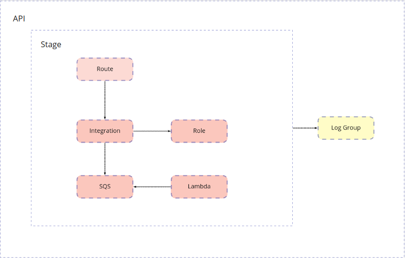

# How to configure SQS integration for API Gateway HTTP API

This guide will show you how to configure SQS integration for HTTP API. Serverless framework does not provide any simple way to connect SQS with an HTTP API route. So, we need to know structure of HTTP API resources, parameters of the resources and other stuff to write custom cloud formation configuration.


Let`s begin with base resources we need for our API.

SQS queue:
```yml
resources:
  Resources:
    Queue:
      Type: AWS::SQS::Queue
```

Lambda:
```yml
functions:
  send:
    handler: handler.handler
    events:
      - sqs:
          arn: !GetAtt Queue.Arn
```

Before continue we need to know structure of HTTP API resources. This picture shows you the structure:



In the red boxes are resources we need to create for our API to configure SQS integration. API, Stage, Log Group are additional resources. Keep focus on resources in the red boxes, we will talk about the others resources later.

**Route** - directs incoming API requests to backend resources(**Integration**, for example)

**Integration** - connects a **Route** to backend resources(**SQS**, for example)

**Role** - allows **Integration** to perform actions on **SQS**

**API** - Our API

**Stage** - a stage we deploy our API to

**Log Group** - an optional CloudWatch logs group to put API access logs

Let`s continue filling our serverless configuration.

```yml
resources:
  Resources:
    ...
    Integration:
      Type: AWS::ApiGatewayV2::Integration
      DependsOn:
        - HttpApi
        - Role
        - Queue
      Properties:
        ApiId: !Ref HttpApi
        CredentialsArn: !GetAtt Role.Arn
        IntegrationType: 'AWS_PROXY'
        IntegrationSubtype: 'SQS-SendMessage'
        PayloadFormatVersion: '1.0'
        ResponseParameters:
          '200':
            ResponseParameters:
              - Source: '$context.integration.status'
                Destination: 'overwrite:statuscode'
        RequestParameters:
          QueueUrl: !Ref Queue
          MessageBody: '$request.body'
    Route:
      Type: AWS::ApiGatewayV2::Route
      DependsOn:
        - HttpApi
        - Integration
      Properties:
        ApiId: !Ref HttpApi
        RouteKey: 'POST /send'
        Target: !Join
          - '/'
          - - 'integrations'
            - !Ref Integration
    Role:
      Type: AWS::IAM::Role
      DependsOn:
        - HttpApiLogGroup
        - Queue
      Properties:
        AssumeRolePolicyDocument:
          Version: '2012-10-17'
          Statement:
            - Effect: 'Allow'
              Principal:
                Service:
                  - 'apigateway.amazonaws.com'
              Action:
                - 'sts:AssumeRole'
        Policies:
          - PolicyName: 'AllowSqsIntegration'
            PolicyDocument:
              Version: '2012-10-17'
              Statement:
                - Effect: 'Allow'
                  Resource: !GetAtt Queue.Arn
                  Action:
                    - 'sqs:SendMessage'
                    - 'sqs:GetQueueUrl'
                    - 'sqs:SendMessageBatch'
    ...
```
In the configuration above we defined:
- An Integration connected to SQS queue
- A Route connected to the Integration
- A Role. The Integration uses this role to perform actions on the queue.

There are some resources you don`t know yet. Here is description:

 - **HttpApi** - It\`s the API resource. If you have at least one lambda connected to `http-api` event then serverless framework creates this resource for you. If you don`t have one then you have to create it. The required configuration will be provided later.
 - **HttpApiLogGroup** - Here will be access logs. The required configuration will be provided later.

Additional resources you need to create if you don\`t have any lambda with `http-api` event:

```yml
resources:
  Resources:
    ...
    HttpApi:
      Type: AWS::ApiGatewayV2::Api
      Properties:
        Name: !Ref AWS::StackName
        ProtocolType: 'HTTP'
    HttpApiLogGroup:
      Type: 'AWS::Logs::LogGroup'
      Properties:
        LogGroupName: !Join
          - ''
          - - /aws/http-api/
            - !Ref AWS::StackName
    HttpApiStage:
      Type: AWS::ApiGatewayV2::Stage
      DependsOn:
        - HttpApi
        - HttpApiLogGroup
      Properties:
        ApiId: !Ref HttpApi
        StageName: '$default'
        AutoDeploy: true
        DefaultRouteSettings:
          DetailedMetricsEnabled: true
        AccessLogSettings:
          DestinationArn: !GetAtt HttpApiLogGroup.Arn
          Format: '{"requestId":"$context.requestId","ip":"$context.identity.sourceIp","requestTime":"$context.requestTime","httpMethod":"$context.httpMethod","routeKey":"$context.routeKey","status":"$context.status","protocol":"$context.protocol","responseLength":"$context.responseLength"}'
    ...
```

The configuration is done. Let`s deploy our service:

```bash
$ sls deploy -v
```

At the end of console output you will see `Stack Outputs` block, for example:
```
Stack Outputs

SendLambdaFunctionQualifiedArn: arn:aws:lambda:us-east-1:832471001844:function:api-geteway-http-api-sqs-integration-dev-send:3
SendUrl: https://f6ch0jydll.execute-api.us-east-1.amazonaws.com/send
ServerlessDeploymentBucketName: api-geteway-http-api-sqs-serverlessdeploymentbuck-p9zhlosbimq6

```

**SendUrl** - Contains our API endpoint to send requests. Use this URL to send requests.

Send request to the API endpoint to verify that everything is working:
```bash
$ curl --location --request POST 'https://f6ch0jydll.execute-api.us-east-1.amazonaws.com/send' --header 'Content-Type: application/json' --data-raw '{}'
```

Done!

To better understand what is going here check this articles out:
- [https://docs.aws.amazon.com/apigateway/latest/developerguide/http-api-logging.html](https://docs.aws.amazon.com/apigateway/latest/developerguide/http-api-logging.html)
- [https://docs.aws.amazon.com/apigateway/latest/developerguide/http-api-develop-integrations-aws-services.html](https://docs.aws.amazon.com/apigateway/latest/developerguide/http-api-develop-integrations-aws-services.html)
- [https://docs.aws.amazon.com/AWSCloudFormation/latest/UserGuide/AWS_ApiGatewayV2.html](https://docs.aws.amazon.com/AWSCloudFormation/latest/UserGuide/AWS_ApiGatewayV2.html)
- [https://docs.aws.amazon.com/AWSCloudFormation/latest/UserGuide/AWS_Logs.html](https://docs.aws.amazon.com/AWSCloudFormation/latest/UserGuide/AWS_Logs.html)
- [https://docs.aws.amazon.com/AWSCloudFormation/latest/UserGuide/intrinsic-function-reference.html](https://docs.aws.amazon.com/AWSCloudFormation/latest/UserGuide/intrinsic-function-reference.html)
- [https://docs.aws.amazon.com/AWSCloudFormation/latest/UserGuide/pseudo-parameter-reference.html](https://docs.aws.amazon.com/AWSCloudFormation/latest/UserGuide/pseudo-parameter-reference.html)
- [https://docs.aws.amazon.com/apigateway/latest/developerguide/http-api.html](https://docs.aws.amazon.com/apigateway/latest/developerguide/http-api.html)
